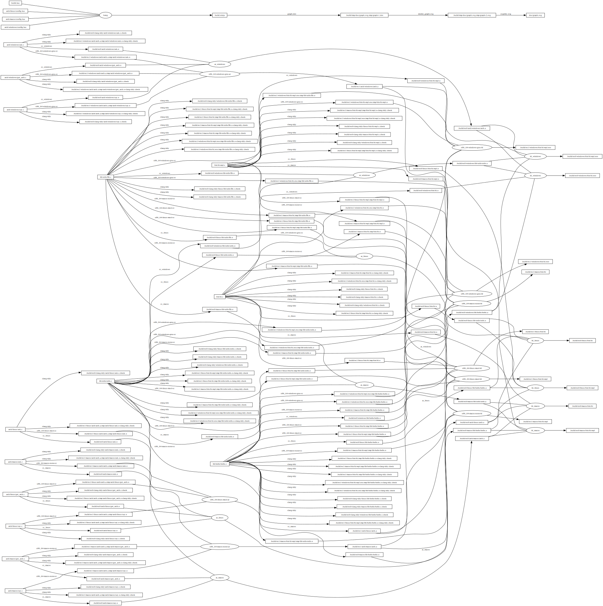

Bang example
============

This example shows how to:

- discover source files actually present in the repository
    - no redundant hard coded file lists (redundancy means painful maintenance)
- cross-compile the same sources for multiple platforms
    - compilation for several platforms without any dirty copy/paste
- describe static libraries:
  in the `lib` directory, each sub-directory is a library compiled and archived in its own `.a` file
- describe executables:
  in the `bin` directory, each C source file is the main file of a binary containing this C file
  as well as libraries from the `lib` directory.

[`build.lua`](build.lua) contains Lua code that produces [`build.ninja`](build.ninja)
(or just run [`build.sh`](build.sh) to recompile bang and this example).

For more information, just look at the sources...

**Note**: Cross-compilation requires cross-compilers for all targeted platforms.
For sake of simplicity, this example uses [Zig](https://ziglang.org/) as a C cross-compiler.

Just for fun, here is the dependency graph (not sure it's usable when the project grows...):

